<p align="center">
  <a href="./docs/README.md">
    
  </a>
</p>

<h1 align="center">Internal AI Knowledge Assistant</h1>

<p align="center">
  <a href="https://github.com/Andrey787878/ai-knowledge-assistant/actions/workflows/ci.yml"></a>
  <a href="https://github.com/Andrey787878/ai-knowledge-assistant/actions/workflows/cd-k3s-auto.yml"></a>
  <a href="./LICENSE"></a>
  <a href="./docs/README.md"></a>
</p>

<p align="center">
Internal AI Knowledge Assistant представляет собой платформенный DevOps/SRE-проект, который разворачивает внутреннего AI-агента компании с корпоративной базой знаний.
</p>

## Оглавление

| Раздел       | Переход                                                                                                                                                            |
| ------------ | ------------------------------------------------------------------------------------------------------------------------------------------------------------------ |
| Обзор        | [Если кратко](#если-кратко) · [Зачем вообще этот проект](#зачем-вообще-этот-проект) · [Как работает система](#как-работает-система)                                |
| Демо         | [Пользовательский сценарий](#демо-пользовательского-сценария) · [Observability-слой](#демо-observability-слоя)                                                     |
| Архитектура  | [Почему это DevOps/SRE-кейс](#почему-это-именно-devopssre-кейс) · [Этап A](#этап-a-vm-контур) · [Этапы B и C](#этапы-b-и-c-kubernetes-контур-cicd-и-observability) |
| Эксплуатация | [Сеть и безопасность](#сеть-и-безопасность) · [Эксплуатация и восстановление](#эксплуатация-и-восстановление)                                                      |
| Навигация    | [Структура репозитория](#структура-репозитория) · [Документация](#документация) · [Будущее развитие проекта](#будущее-развитие-проекта)                            |

## Если кратко...

Проект демонстрирует не только запуск системы, а полный инфраструктурный и эксплуатационный слои вокруг нее.

Собрано два воспроизводимых контура деплоя:

- Этап A - деплой в `4` виртуальные машины через `Terraform + Ansible + Docker Compose`.
- Этапы B и C - деплой `k3s` через `Terraform + Ansible bootstrap + Helmfile` с отдельным эксплуатационным слоем поверх Kubernetes-контура.

В этапах B и C дополнительно реализованы:

- `CI/CD` в `GitHub Actions` с собственным runner на своей VM,
- `observability` с `3` кастомными дашбордами, алертами, синтетическими пробами и
  логированием,
- backup/restore, smoke-проверки и зафиксированные `SLO` и `SLI` для ключевых сервисов.

## Зачем вообще этот проект?

В командах часто возникают ситуации, когда знания об инфраструктуре,
внутренних процессах или других рабочих вопросах распределены по разным
несвязанным источникам.

Из-за этого:

- важные знания теряются при отпуске или уходе сотрудников,
- новым сотрудникам сложнее погрузиться в работу,
- одни и те же вопросы повторяются,
- время, затраченное на решение инцидентов, увеличивается.

Цель проекта - создать единую централизованную систему, которая использует Wiki.js как базу знаний и предоставляет быстрые, структурированные ответы на вопросы при помощи локальной LLM-модели.

## Как работает система?

Wiki.js выступает единым централизованным источником знаний, PostgreSQL хранит
данные Wiki.js, состояние `n8n` и память диалогов, Redis используется как
брокер для режима очереди, `n8n` разделен на `web` и `worker` и выполняет
роль оркестратора, а Ollama запускает локальную LLM.

Пользователь задает вопрос, `n8n` обрабатывает основной workflow: достает
релевантный контекст из базы Wiki.js, формирует промпт, отправляет запрос в
Ollama и применяет защитную логику. Если подходящего контекста нет,
ассистент не выдумывает ответ, а возвращает "Нет данных".

Таблица компонентов:

| Компонент  | Роль                                                                      |
| ---------- | ------------------------------------------------------------------------- |
| Wiki.js    | хранит страницы базы знаний                                               |
| n8n-web    | принимает запросы через UI/API/webhook                                    |
| n8n-worker | выполняет workflow в режиме очереди                                       |
| Redis      | брокер очереди для `n8n` в режиме очереди                                 |
| PostgreSQL | хранит данные Wiki.js, n8n и память диалогов агента                       |
| Ollama     | запускает локальную LLM без передачи внутреннего контекста во внешние API |

## Демо пользовательского сценария

> Клиентский IP CIDR должен входить в allow-list, иначе `n8n` и `Wiki.js` будут недоступны.

### База знаний пуста, пользователь заходит в `chat_ui` workflow `n8n` и спрашивает: "Что такое Docker?"

<p align="center">
  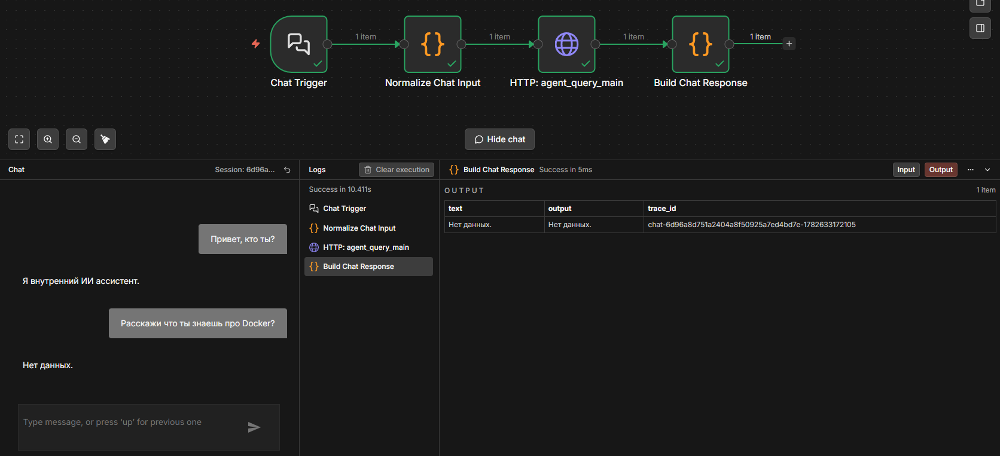
</p>

### Пользователь заходит в `Wiki.js` и добавляет небольшую статью по основам Docker

<p align="center">
  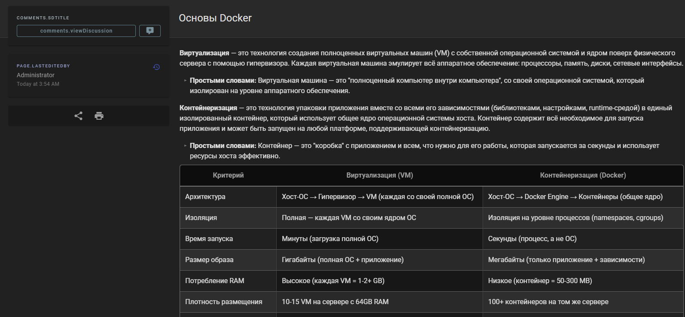
</p>

### Затем снова задает тот же вопрос и получает ответ, сформированный из текста статьи

<p align="center">
  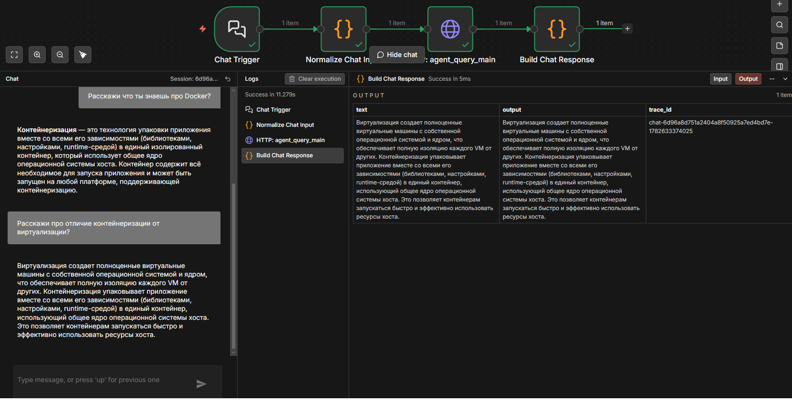
</p>

### После этого пользователь спрашивает о том, чего нет в базе знаний, и агент отвечает: "Нет данных"

<p align="center">
  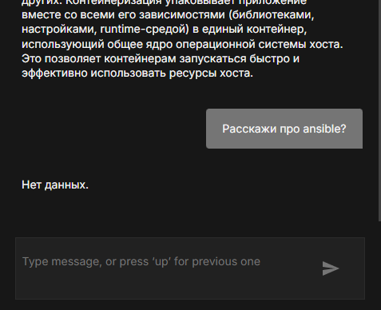
</p>

### Также пользователь может задать вопрос не только через интерфейс, но и из терминала, вызвав основной workflow

<p align="center">
  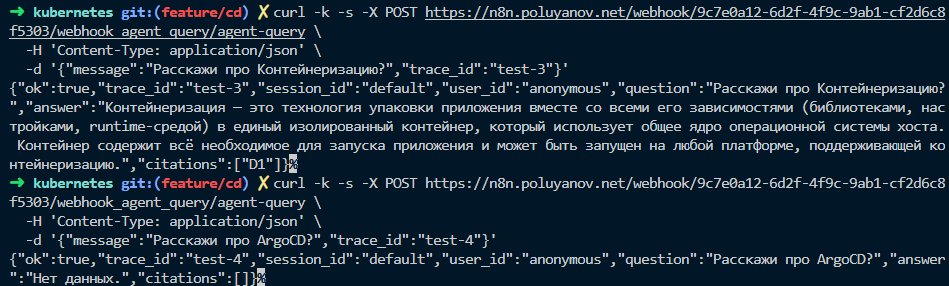
</p>

> Пользовательский сценарий един на каждом этапе, меняется именно внутреннее устройство системы.

## Демо observability-слоя

### Дашборд `n8n Runtime`: что происходит внутри основного сервиса

<p align="center">
  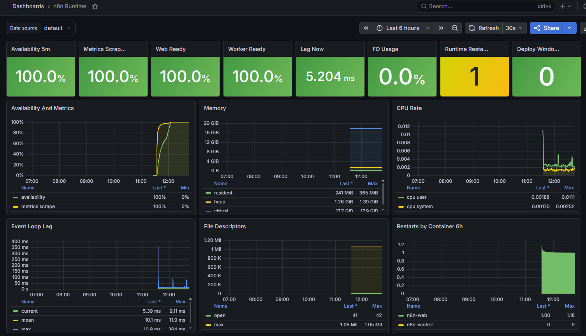
</p>

Этот экран отвечает на вопрос: что именно происходит с `n8n` во время работы
и почему сервис может деградировать. На нем собраны доступность, readiness
`web/worker`, лаг event loop, нагрузка на CPU, память, файловые дескрипторы,
рестарты контейнеров и окно rollout.

### Дашборд `Public Endpoints`: что видит пользователь снаружи

<p align="center">
  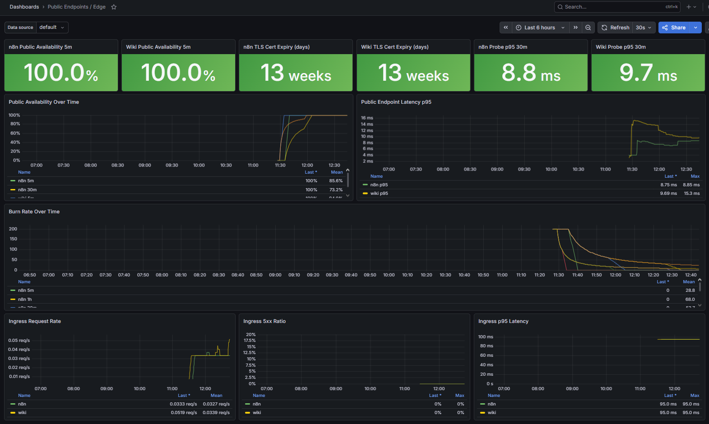
</p>

Этот экран отвечает на вопрос: доступен ли внешний путь до сервиса и не
деградировал ли он для пользователя. Здесь собраны публичная доступность,
срок жизни TLS-сертификатов, задержка синтетических проверок, скорость
выжигания бюджета ошибок, скорость входящего трафика, доля `5xx` на ingress и
`p95` задержки.

### Дашборд `Observability Overview`: общая картина по контуру

<p align="center">
  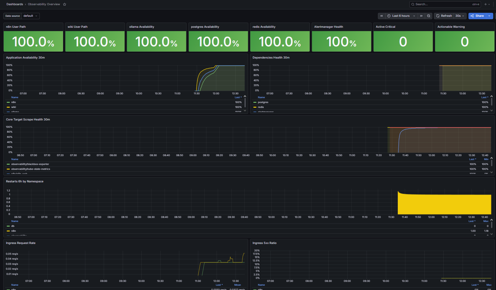
</p>

Этот экран отвечает на вопрос: где именно сейчас проблема: в приложении,
во внешнем пользовательском пути, в зависимости или в самом контуре
наблюдаемости. Он нужен для общей оценки состояния системы
перед переходом в более детальный дашборд.

### Управляемая поломка основного компонента системы - отказ Wiki.js

Намеренно подменим `selector`, после чего wiki
теряет `Endpoints`, а публичный `https://wiki.poluyanov.net/healthz` начинает
отвечать ошибкой.

<p align="center">
  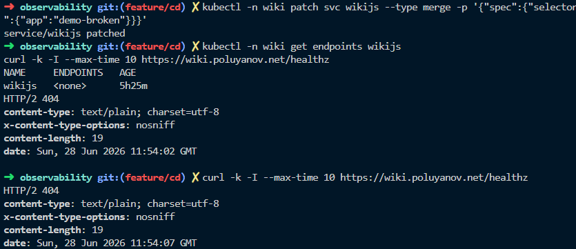
</p>

После такой поломки observability фиксирует отказ на внутреннем и
пользовательском уровнях. Примерно через `5` минут на почту приходят два
алерта: `WikiDown` и `WikiPublicEndpointDown`.

<p align="center">
  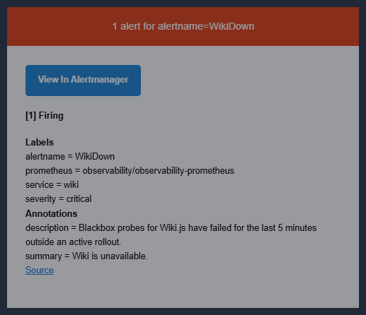
</p>

<p align="center">
  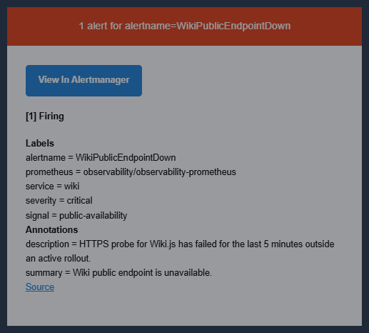
</p>

### Управляемая поломка зависимости - отказ Redis

Намеренно масштабируем `redis-master` в `0`, после чего StatefulSet перестает держать рабочую реплику, а сервис Redis теряет `Endpoints`.

<p align="center">
  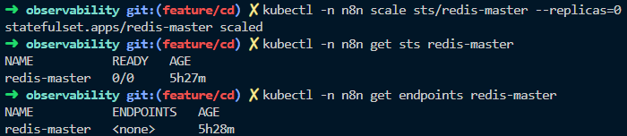
</p>

Этот сценарий показывает корректную реакцию на сбой внутренней зависимости.
На почту уходит только `RedisDown`, а производные сигналы `n8n` остаются в UI
`Alertmanager`. По той же логике `PostgresDown` подавляет производные сигналы
для `n8n` и `wiki`, если их недоступность вызвана именно падением
`postgres`.

На почту прилитает лишь `1` алерт:

<p align="center">
  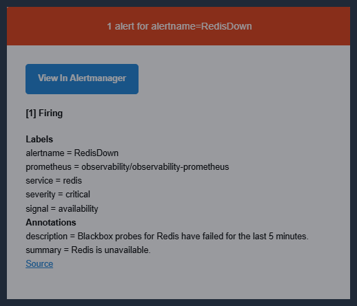
</p>

### Какие SLO и SLI зафиксированы?

Наборы SLI/SLO разделены на три уровня: сервисные - по доступности ключевых сервисов, пользовательские - по качеству HTTP-пути и эксплуатационные - самого контура наблюдаемости.

#### Сервисные SLO по доступности

| Сервис     | SLI                     | Источник                                 | SLO             |
| ---------- | ----------------------- | ---------------------------------------- | --------------- |
| `n8n`      | внутренняя доступность  | blackbox-проверка `blackbox-n8n`         | `99.5%` в месяц |
| `n8n`      | внешняя доступность     | blackbox-проверка `blackbox-public-n8n`  | `99.5%` в месяц |
| `wiki`     | внутренняя доступность  | blackbox-проверка `blackbox-wiki`        | `99.5%` в месяц |
| `wiki`     | внешняя доступность     | blackbox-проверка `blackbox-public-wiki` | `99.5%` в месяц |
| `ollama`   | внутренняя доступность  | blackbox-проверка `blackbox-ollama`      | `99.0%` в месяц |
| `postgres` | доступность зависимости | blackbox-проверка `blackbox-postgres`    | `99.9%` в месяц |
| `redis`    | доступность зависимости | blackbox-проверка `blackbox-redis`       | `99.9%` в месяц |

#### Пользовательские SLO по качеству HTTP-пути

| Сервис | SLI                   | Источник                 | SLO                                                       |
| ------ | --------------------- | ------------------------ | --------------------------------------------------------- |
| `n8n`  | доля `5xx` на ingress | метрики роутеров Traefik | доля `5xx`-ответов за месяц не превышает `0.5%`           |
| `wiki` | доля `5xx` на ingress | метрики роутеров Traefik | доля `5xx`-ответов за месяц не превышает `0.5%`           |
| `n8n`  | задержка на ingress   | метрики роутеров Traefik | не менее `99%` 5-минутных окон за месяц имеют `p95 <= 1s` |
| `wiki` | задержка на ingress   | метрики роутеров Traefik | не менее `99%` 5-минутных окон за месяц имеют `p95 <= 1s` |

#### Операционные цели контура наблюдаемости

| Компонент      | SLI                                           | Источник                                  | SLO                                             |
| -------------- | --------------------------------------------- | ----------------------------------------- | ----------------------------------------------- |
| `prometheus`   | успешность сбора метрик по обязательным целям | метрика `up` по обязательным целям        | не ниже `99%` успешных проверок за `30 минут`   |
| `alertmanager` | успешность доставки уведомлений               | метрики доставки уведомлений Alertmanager | не ниже `99%` успешных уведомлений за `5 минут` |

> Подробнее про SLO и SLI проекта можно прочитать [здесь](./docs/kubernetes_deploy/sli-slo.md).

## Почему это именно DevOps/SRE-кейс?

Это не только деплой приложения, а полный эксплуатационный контур вокруг него:
облачная сеть, доставка изменений, TLS, секреты, изоляция сервисов,
резервное копирование и восстановление, smoke-проверки, наблюдаемость,
алертинг и документация.

Проект разложен на два инфраструктурных контура деплоя, а Kubernetes-часть
дополнительно разделена на платформенный и эксплуатационный уровни:

| Этап   | Модель                         | Основной стек                                                                                                                      |
| ------ | ------------------------------ | ---------------------------------------------------------------------------------------------------------------------------------- |
| Этап A | 4 VM в Yandex Cloud            | Terraform, Ansible, Docker Compose, Nginx, Ansible-vault                                                                           |
| Этап B | single-node k3s в Yandex Cloud | Terraform, Ansible bootstrap, Kubernetes, Helmfile, SOPS                                                                           |
| Этап C | CI/CD и observability          | GitHub Actions CI/CD, отдельная runner-VM, kube-prometheus-stack, Alertmanager, Grafana, Loki, Alloy, blackbox-проверки, SLO и SLI |

## Цифры. Что реализовано?

### Инфраструктура

- `2` воспроизводимых контура деплоя: VM-контур и Kubernetes-контур.
- `1` эксплуатационный этап, который добавляет к Этапу B CI/CD и observability.
- `1` отдельная VM для runner GitHub Actions.
- `4` VM в Этапе A: `wiki`, `db`, `n8n`, `ollama`.
- `1` публичная VM в Этапе A: только `wiki` имеет публичный IP и выполняет роль edge + bastion.
- `1` публичная VM в Этапе B: только VM кластера `k3s` имеет публичный IP и служит бастионом для runner.
- `7` Helmfile-слоев в Этапе B: `platform`, `observability`, `postgres`, `redis`, `wiki`, `ollama`, `n8n`.
- `2` собственных Helm-чарта: `n8n` и `ollama`.
- Резервное копирование и восстановление `PostgreSQL` реализовано на обоих этапах, с проверкой целостности и явным подтверждением восстановления.
- Подробная документация по каждому этапу и архитектурные схемы.

### CI/CD

- `1` GitHub Actions CI workflow с `5` независимыми job: repository sanity,
  secret scan, Terraform, Helm, Ansible syntax.
- `2` GitHub Actions CD workflow для kubernetes-контура: `cd-k3s-auto` и
  `cd-k3s-manual`.
- `1` CI quality gate перед автоматической выкладкой в production и перед
  ручной выкладкой выбранного `ref`.
- `5` n8n workflow: `agent_query_main`, `memory_read`, `memory_write`, `agent_chat_ui`, `agent_smoke_e2e`.

### Observability

- `3` кастомных Grafana дашборда в observability-слое: `Observability Overview`, `n8n Runtime`, `Public Endpoints / Edge`.
- `6` групп алерт-правил: внутренняя доступность, внешний пользовательский путь, зависимости, runtime `n8n`, self-monitoring, ingress HTTP.
- `2` публичные синтетические HTTPS-пробы.
- `5` внутренних blackbox-проверок для `n8n`, `wiki`, `ollama`, `postgres`, `redis`.
- `13` SLI/SLO зафиксировано на этапе C: `9` сервисных и пользовательских, `2` по внутренним зависимостям, `2` по самому контуру наблюдаемости.
- Все `4` золотых сигнала покрыты на Этапе C: latency, traffic, errors и saturation.

## Этап A: VM-контур

Этап A разворачивает сервисы в 4 VM Yandex Cloud через Terraform, Ansible и Docker Compose.

### Схема

<p align="center">
  <a href="./docs/ansible_vm_deploy/diagrams/network-topology.png">
    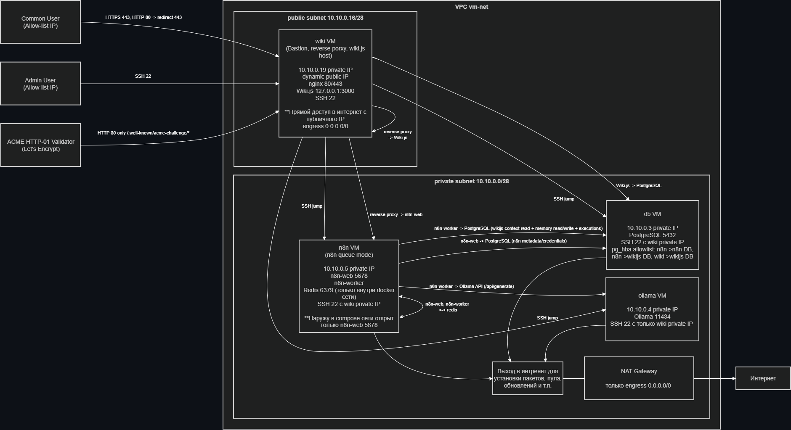
  </a>
</p>

> При клике на изображение откроется схема в полном размере.

Terraform создает инфраструктуру VM-контура: сеть, виртуальные машины и
базовый cloud-периметр для сервисов.

<p align="center">
  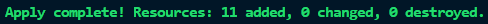
</p>

Что реализовано:

- Terraform создает VPC, public/private subnet, NAT egress, Security Groups и VM.
- В public subnet находится только `wiki` VM с public IP.
- `db`, `n8n`, `ollama` находятся в private subnet без public IP.
- Доступ к private VM идет через bastion/SSH ProxyJump.
- Ansible настраивает хосты, Docker, firewall, сервисы и smoke-проверки.
- Nginx на edge VM выполняет reverse proxy для Wiki.js и n8n.
- TLS выпускается через Let's Encrypt ACME HTTP-01.
- PostgreSQL дополнительно ограничен через `pg_hba.conf`.
- Секреты в Ansible Vault.
- Backup/restore PostgreSQL вынесен в отдельные Ansible playbook'и и роль.

Ключевые директории:

| Область      | Путь                              |
| ------------ | --------------------------------- |
| Terraform    | `deploy/terraform/ansible_deploy` |
| Ansible      | `deploy/ansible`                  |
| Документация | `docs/ansible_vm_deploy`          |

После создания инфраструктуры Ansible настраивает хосты, разворачивает
сервисы и доводит контур до рабочего состояния.

<p align="center">
  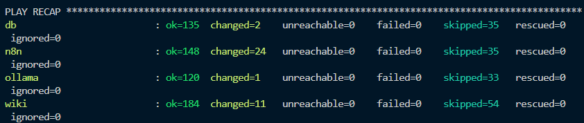
</p>

## Этапы B и C: Kubernetes-контур, CI/CD и observability

Этап B переносит систему в single-node `k3s` в Yandex Cloud через Terraform,
Ansible bootstrap и Helmfile. Этап C не создает отдельный контур поверх него,
а добавляет к уже собранному Kubernetes-этапу доставку изменений и
наблюдаемость: отдельный runner, CI/CD-процессы, дашборды, алертинг и
служебные SLI/SLO.

### Схема

<p align="center">
  <a href="./docs/kubernetes_deploy/diagrams/network-topology.png">
    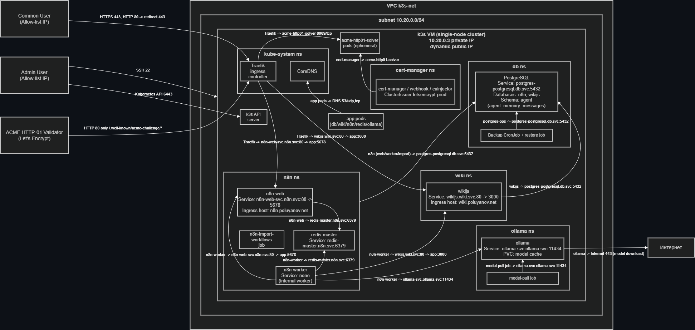
  </a>
</p>

> При клике на изображение откроется схема в полном размере.

Terraform создает инфраструктуру Kubernetes-контура: VM `k3s`, опциональную
VM для runner, сеть, NAT и группы безопасности.

<p align="center">
  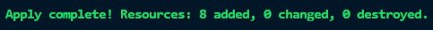
</p>

После `terraform apply` можно отдельно проверить уже созданные ресурсы через
`yc`, чтобы убедиться, что кластерная VM и runner VM действительно поднялись в
ожидаемой сети и подсети.

<p align="center">
  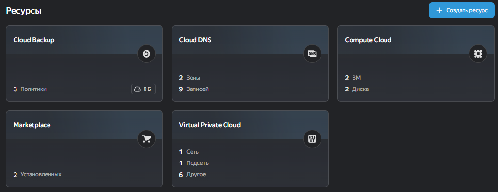
</p>

Bootstrap подготавливает хост, устанавливает `k3s`, настраивает firewall и,
при необходимости, регистрирует runner.

<p align="center">
  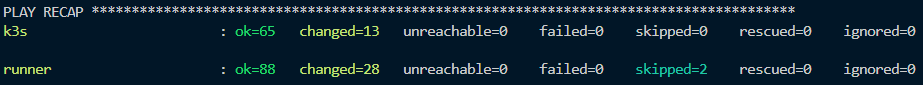
</p>

После bootstrap локальный `kubeconfig` уже можно выгрузить и сразу проверить,
что `kubectl` подключается именно к новому `k3s`-кластеру.

<p align="center">
  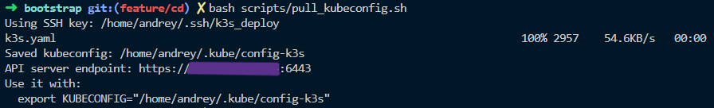
</p>

### Что реализовано

- Terraform создает cloud-инфраструктуру для `k3s`-кластера,
- вместе с `k3s` может быть поднята отдельная VM для runner без публичного IP в той же подсети,
- публичный хост `k3s` выполняет роль бастиона для доступа к runner через `ProxyJump`,
- Ansible bootstrap устанавливает `k3s` с фиксированной версией и checksum-проверкой бинарника,
- `k3s` настраивается с TLS SAN и шифрованием Kubernetes Secrets at rest,
- корневой Helmfile собирает платформенный слой, прикладные слои и слой observability,
- автоматическая и ручная выкладка выполняются по слоям через Helmfile,
- GitHub Actions CI проверяет YAML, workflow JSON, секреты, Terraform, Helm/Helmfile/kubeconform и Ansible syntax-check,
- runner работает внутри того же контура и ходит в Kubernetes API по приватному адресу,
- используется встроенный в `k3s` Traefik ingress controller,
- cert-manager и ClusterIssuer выпускают TLS-сертификаты через ACME HTTP-01,
- HTTP-to-HTTPS redirect настроен через Traefik Middleware,
- Kubernetes secrets хранятся в SOPS-encrypted values,
- для `n8n` и `Ollama` написаны собственные Helm-чарты,
- PostgreSQL, Redis, Wiki.js, cert-manager, observability-компоненты и raw-ресурсы разворачиваются через локально сохраненные сторонние Helm-чарты,
- NetworkPolicy реализует запрет по умолчанию и точечные разрешения только для нужных сервисных связей,
- `kube-prometheus-stack`, `Loki`, `Alloy`, blackbox-пробы, маршрутизация алертов и `3` преднастроенных Grafana-дашборда собирают эксплуатационный observability-слой.

Для ручного `CD` в этом контуре сознательно поддерживаются три режима:
`full`, `scope` и `changed`. Режим `changed` задуман как вспомогательный режим:
он вычисляет измененные слои из `git diff` для выбранного `ref` и удобен для
частичного повторного прогона после merge или для локальной выкладки нужного
слоя. Для самого предсказуемого production-сценария предпочтительнее `full`
или явный `scope`.

> Демо наблюдаемости выше в README вы уже могли видеть: там отдельно показаны
> дашборды, и сценарии отказов.

После bootstrap кластер поднят, а control-plane нода находится в состоянии
`Ready`.

<p align="center">
  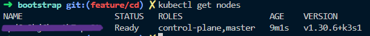
</p>

В кластере запущены платформенные компоненты, прикладные сервисы и observability-стек.

<p align="center">
  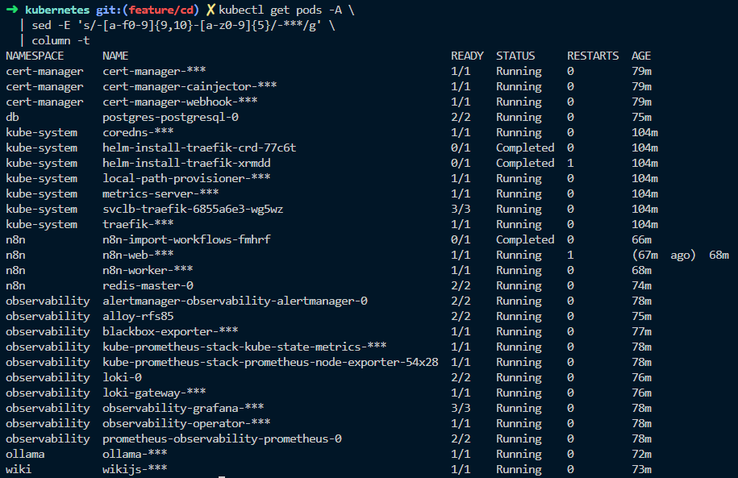
</p>

Ingress-маршруты подтверждают публикацию внешнего HTTP/HTTPS-пути через
Traefik.

<p align="center">
  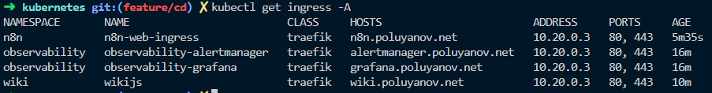
</p>

### CI/CD

скрины CI/CD

Ключевые директории:

| Область               | Путь                                       |
| --------------------- | ------------------------------------------ |
| Terraform             | `deploy/terraform/k3s_deploy`              |
| Ansible k3s bootstrap | `deploy/kubernetes/bootstrap`              |
| Helmfile root         | `deploy/kubernetes/helmfile.yaml`          |
| Platform              | `deploy/kubernetes/platform`               |
| Observability         | `deploy/kubernetes/observability`          |
| Applications          | `deploy/kubernetes/apps`                   |
| CI/CD                 | `.github/workflows`                        |
| CD scripts            | `.github/scripts/cd`                       |
| Alerting/SLI          | `deploy/kubernetes/observability/releases` |
| Документация          | `docs/kubernetes_deploy`                   |

## Сеть и безопасность

Проектная модель строится вокруг минимальной публичной поверхности и явных сервисных потоков.

Общие принципы:

- внешний вход только через edge и ingress,
- SSH- и web-доступ ограничиваются allow-list CIDR,
- внутренние сервисы не публикуются напрямую в интернет,
- доступы дублируются на нескольких уровнях: облачный периметр, host firewall,
  application/cluster policy,
- TLS обязателен для внешнего пользовательского трафика,
- секреты не хранятся в открытом виде в репозитории.

Этап A:

| Уровень         | Реализация                                             |
| --------------- | ------------------------------------------------------ |
| Cloud perimeter | Yandex Cloud Security Groups                           |
| Сегментация     | public/private subnet, публичный IP только у `wiki` VM |
| Админ-доступ    | SSH через bastion/ProxyJump                            |
| Host firewall   | firewalld, source-based rich rules, strict reconcile   |
| Edge            | Nginx reverse proxy, allow-list, TLS/ACME HTTP-01      |
| Database access | PostgreSQL `pg_hba.conf` с явными источниками          |
| Egress          | private VM выходят наружу через NAT                    |

Этапы B и C:

| Уровень         | Реализация                                                     |
| --------------- | -------------------------------------------------------------- |
| Cloud perimeter | Yandex Cloud Security Group                                    |
| Сегментация     | публичный IP только у `k3s`, runner остается private-only      |
| Админ-доступ    | SSH к runner только через `k3s` по `ProxyJump`                 |
| Host firewall   | UFW, deny incoming, allow только нужных портов/CIDR            |
| Edge            | встроенный Traefik ingress controller                          |
| TLS             | cert-manager + ClusterIssuer + ACME HTTP-01                    |
| Secrets         | SOPS values и шифрование `k3s` secrets at rest                 |
| Pod network     | NetworkPolicy с запретом по умолчанию и точечными разрешениями |
| Egress          | DNS для нужных pod'ов, Internet 443 только где требуется       |

## Эксплуатация и восстановление

Что реализовано:

- smoke-проверки после деплоя,
- минимальный e2e workflow для проверки агентского сценария,
- импорт n8n workflows без ручной настройки через UI,
- PostgreSQL backup/restore в VM-контуре через Ansible,
- PostgreSQL backup CronJob и one-shot restore Job в Kubernetes-контуре,
- проверка целостности backup перед restore,
- явное подтверждение restore,
- runbook'и по сети, сертификатам, backup/restore и операциям,
- архитектурные схемы для обоих этапов.

Дополнительно в observability-слое реализованы:

- `3` Grafana-дашборда для overview, runtime и public edge-path,
- SLI/SLO слой для внутренней доступности, внешней доступности, задержек и ошибок на ingress, а также доступности зависимостей,
- маршрутизация Alertmanager, в которой почтовые рабочие алерты отделены от
  предупреждающих сигналов, нужных только для истории и интерфейса,
- self-monitoring для Prometheus scrape health и доставки уведомлений.

Отдельно в CI уже реализованы:

- `yamllint` для `.github` и `deploy`,
- валидация `n8n` workflow JSON,
- `gitleaks` secret scan,
- `terraform fmt`, `terraform validate`, `tflint`,
- `helm lint`, `helm template`, `helmfile build/template`, `kubeconform`,
- `shellcheck`, `bash -n` и `ansible-playbook --syntax-check` для VM и k3s bootstrap playbook'ов.

## Структура репозитория

```text
.github/
  workflows/            # CI и CD workflow GitHub Actions
  scripts/              # вспомогательные скрипты для CI/CD

deploy/
  terraform/
    ansible_deploy/     # Terraform для 4 VM контура
    k3s_deploy/         # Terraform для k3s контура
  ansible/              # Ansible роли и playbook'и этапа A
  kubernetes/
    bootstrap/          # Ansible bootstrap для k3s и VM runner
    platform/           # namespaces, cert-manager, ClusterIssuer
    apps/               # postgres, redis, wiki, ollama, n8n
    observability/      # Prometheus, Grafana, Alertmanager, Loki, Alloy
    vendor_charts/      # локально сохраненные сторонние Helm-чарты

docs/
  README.md             # единая точка входа в документацию
  ansible_vm_deploy/    # документация этапа A
  kubernetes_deploy/    # документация этапов B и C

n8n/
  workflows/            # workflow ассистента, памяти, UI и smoke
```

## Документация

<p align="center">
  <a href="./docs/README.md"></a>
  <a href="./docs/ansible_vm_deploy/README.md"></a>
  <a href="./docs/kubernetes_deploy/README.md"></a>
  <a href="./n8n/workflows/README.md"></a>
</p>

## Будущее развитие проекта

Что я думаю допиливать дальше:

- **Staging перед production rollout**: добавить отдельный staging-контур в CD,
  чтобы изменения сначала проходили проверку в промежуточной среде, а уже
  потом выкатывались в прод,
- **Multi-node cluster**: перейти от single-node к кластеру из
  нескольких нод,
- **Multi-replica deployment для user-facing сервисов**: закрепить topology, в
  которой `n8n`, `wiki` и другие масштабируемые компоненты работают не в одной
  реплике, а в отказоустойчивом режиме,
- **HPA для масштабируемых workloads**: добавить horizontal autoscaling поверх
  уже собранного observability-слоя и метрик, чтобы cluster реагировал на
  нагрузку автоматически,
- **GitOps доставка через ArgoCD**: перевести Kubernetes CD от императивной
  `helmfile sync` модели к постоянно сверяемому декларативному deploy-потоку,
- **Собственный UI-интерфейс для чата с LLM**: использовать n8n только как бекенд и сделать свой более удобный интерфейс для общения с агентом.
