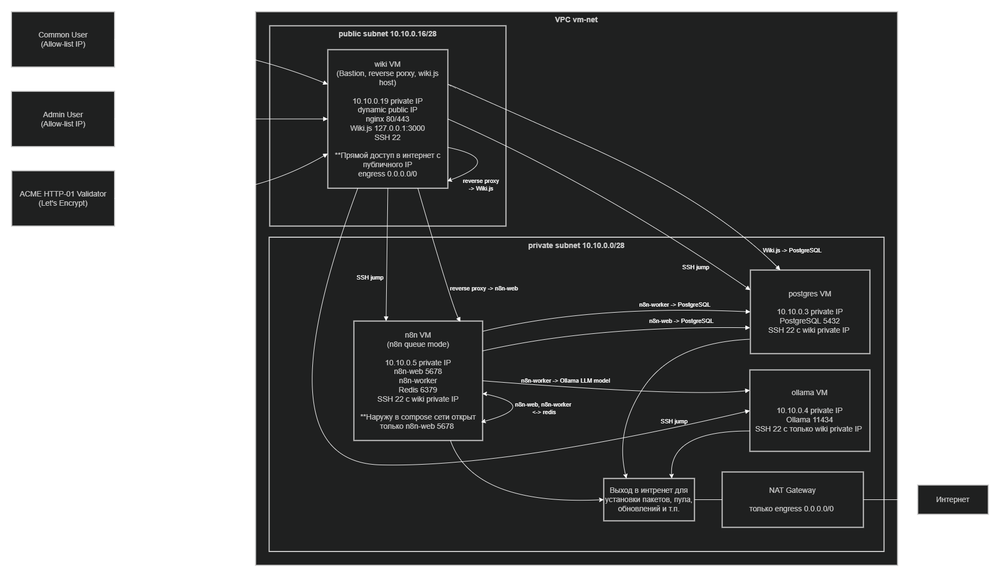

# Этап A (4 VM): ранбук Ansible-деплоя

Пошаговый ранбук для первого и повторного запуска Ansible-этапа.

Индекс документации этапа A: [README этапа A](../../docs/ansible_vm_deploy/README.md)

## Быстрый старт

```bash
cd deploy/ansible

cp inventories/cloud/hosts.yml.example inventories/cloud/hosts.yml
cp inventories/cloud/group_vars/all/zz-local.yml.example inventories/cloud/group_vars/all/zz-local.yml
cp inventories/cloud/group_vars/all/vault.yml.example inventories/cloud/group_vars/all/vault.yml

mkdir -p ~/.ansible
printf '%s\n' '<your-vault-password>' > ~/.ansible/vault-pass.txt
chmod 600 ~/.ansible/vault-pass.txt

export ANSIBLE_ROLES_PATH="$(pwd)/roles"
export ANSIBLE_LOCAL_TEMP="$(pwd)/.ansible/tmp"
export ANSIBLE_SSH_PRIVATE_KEY_FILE="${ANSIBLE_SSH_PRIVATE_KEY_FILE:-~/.ssh/ansible_deploy}"
export ANSIBLE_VAULT_PASSWORD_FILE="${ANSIBLE_VAULT_PASSWORD_FILE:-~/.ansible/vault-pass.txt}"
export ANSIBLE_HOST_KEY_CHECKING=False
export ANSIBLE_FORKS=10
export ANSIBLE_TIMEOUT=30

ansible-vault edit inventories/cloud/group_vars/all/vault.yml

ansible-galaxy collection install -r requirements.yml
ansible-playbook -i inventories/cloud/hosts.yml playbooks/bootstrap_python.yml
ansible-playbook -i inventories/cloud/hosts.yml playbooks/site.yml
ansible-playbook -i inventories/cloud/hosts.yml playbooks/smoke.yml
```

## Схема сети (Ansible VM)



## Связанная документация

- [Индекс Ansible VM документации](../../docs/ansible_vm_deploy/README.md)
- [Карта ролей и playbook](../../docs/ansible_vm_deploy/roles-playbooks-map.md)
- [Этап A: эксплуатация и приемка](../../docs/ansible_vm_deploy/operations-stage-a.md)
- [Сеть Ansible-деплоя](../../docs/ansible_vm_deploy/network.md)
- [Edge TLS и ACME HTTP-01](../../docs/ansible_vm_deploy/edge-tls-acme.md)
- [Ранбук по сертификатам](../../docs/ansible_vm_deploy/certificates-runbook.md)
- [Резервное копирование и восстановление PostgreSQL](../../docs/ansible_vm_deploy/backup-restore.md)

## Оглавление

- [Связанная документация](#связанная-документация)
- [Критерии готовности](#definition-of-done)
- [Подготовьте локальные файлы из `.example`](#step-1)
- [Экспортируйте env для стабильного запуска](#step-2)
- [Секреты и Vault password file](#step-3)
- [Установите коллекции](#step-4)
- [Синтаксис перед прогоном](#step-5)
- [Порядок запуска](#step-6)
- [Частые ошибки и быстрые фиксы](#step-7)
- [Резервное копирование/восстановление (полный ранбук)](#step-8)

<a id="definition-of-done"></a>

## Критерии готовности

- `ansible-playbook ... playbooks/site.yml` завершился с `failed=0`.
- `ansible-playbook ... playbooks/smoke.yml` завершился с `failed=0`.
- Проверки пользовательского контура (`wiki` и `n8n`) проходят по ожидаемым `healthz`-эндпоинтам.

<a id="step-1"></a>

## Подготовьте локальные файлы из `.example`

```bash
cd deploy/ansible

cp inventories/cloud/hosts.yml.example inventories/cloud/hosts.yml
cp inventories/cloud/group_vars/all/zz-local.yml.example inventories/cloud/group_vars/all/zz-local.yml
```

Что заполняем:

- `inventories/cloud/hosts.yml`: реальные `ansible_host` и `private_ip` для `db/ollama/n8n/wiki`.
- `inventories/cloud/group_vars/all/zz-local.yml`: реальные CIDR для
  `firewall_admin_ssh_sources` и `edge_allowed_client_cidrs`.

Оба файла локальные и не коммитятся.

<a id="step-2"></a>

## Экспортируйте env для стабильного запуска

Если при запуске появляется warning про `world writable directory`
и Ansible не подхватывает `ansible.cfg`, экспортируйте переменные ниже.

```bash
cd deploy/ansible

# обход ограничения (игнор ansible.cfg)
export ANSIBLE_ROLES_PATH="$(pwd)/roles"
export ANSIBLE_LOCAL_TEMP="$(pwd)/.ansible/tmp"

# ключ SSH (если не задан, берется ~/.ssh/ansible_deploy)
export ANSIBLE_SSH_PRIVATE_KEY_FILE="${ANSIBLE_SSH_PRIVATE_KEY_FILE:-~/.ssh/ansible_deploy}"

# vault-пароль (после шага 3: secrets)
export ANSIBLE_VAULT_PASSWORD_FILE="${ANSIBLE_VAULT_PASSWORD_FILE:-~/.ansible/vault-pass.txt}"

# повторяем настройки из ansible.cfg, когда он игнорируется
export ANSIBLE_HOST_KEY_CHECKING=False
export ANSIBLE_FORKS=10
export ANSIBLE_TIMEOUT=30
```

Проверка:

```bash
echo "$ANSIBLE_ROLES_PATH"
ls -la "$ANSIBLE_ROLES_PATH/common"
echo "$ANSIBLE_LOCAL_TEMP"
echo "$ANSIBLE_VAULT_PASSWORD_FILE"
```

<a id="step-3"></a>

## Секреты и Vault password file

```bash
cd deploy/ansible
cp inventories/cloud/group_vars/all/vault.yml.example inventories/cloud/group_vars/all/vault.yml
ansible-vault edit inventories/cloud/group_vars/all/vault.yml
```

Заполните `vault.yml` реальными значениями:

```yaml
postgres_superuser_password: '<strong_password>'
postgres_n8n_password: '<strong_password>'
postgres_wiki_password: '<strong_password>'

n8n_postgres_password: '<same_as_postgres_n8n_password>'
wikijs_postgres_password: '<same_as_postgres_wiki_password>'

n8n_common_encryption_key: '<32+ chars secret>'
n8n_common_agent_workflow_token: '<token_for_internal_agent_webhooks>'

# optional but recommended
n8n_redis_password: '<strong_password>'
```

Связка значений должна быть такой:

- `n8n_postgres_password` = `postgres_n8n_password`
- `wikijs_postgres_password` = `postgres_wiki_password`

Быстрая генерация секретов:

```bash
openssl rand -base64 36 | tr -d '\n'
openssl rand -hex 32
```

Проверка/операции с vault:

```bash
# посмотреть содержимое
ansible-vault view inventories/cloud/group_vars/all/vault.yml

# изменить содержимое
ansible-vault edit inventories/cloud/group_vars/all/vault.yml

# сменить vault-пароль
ansible-vault rekey inventories/cloud/group_vars/all/vault.yml
```

Что коммитим/что не коммитим:

- Коммитим: `inventories/cloud/group_vars/all/vault.yml.example`
- Не коммитим: `inventories/cloud/group_vars/all/vault.yml` (реальные секреты)

Создайте локальный файл с vault-паролем и экспортируйте его для всей сессии:

```bash
mkdir -p ~/.ansible
printf '%s\n' '<your-vault-password>' > ~/.ansible/vault-pass.txt
chmod 600 ~/.ansible/vault-pass.txt

export ANSIBLE_VAULT_PASSWORD_FILE=~/.ansible/vault-pass.txt
```

Проверка:

```bash
test -f "$ANSIBLE_VAULT_PASSWORD_FILE" && echo "vault file: ok"
ansible-vault view inventories/cloud/group_vars/all/vault.yml >/dev/null && echo "vault decrypt: ok"
```

<a id="step-4"></a>

## Установите коллекции

```bash
cd deploy/ansible
ansible-galaxy collection install -r requirements.yml
```

<a id="step-5"></a>

## Синтаксис перед прогоном

```bash
cd deploy/ansible
ansible-playbook -i inventories/cloud/hosts.yml playbooks/site.yml --syntax-check
```

<a id="step-6"></a>

## Порядок запуска

```bash
cd deploy/ansible
ansible-playbook -i inventories/cloud/hosts.yml playbooks/bootstrap_python.yml
ansible-playbook -i inventories/cloud/hosts.yml playbooks/site.yml
ansible-playbook -i inventories/cloud/hosts.yml playbooks/smoke.yml
```

`smoke.yml` запускает e2e webhook проверку по умолчанию.
Если нужно временно отключить e2e:

```bash
ansible-playbook -i inventories/cloud/hosts.yml playbooks/smoke.yml \
  -e '{"smoke_agent_e2e_enabled": false}'
```

Детали по edge TLS и HTTP-01 challenge:
[docs/ansible_vm_deploy/edge-tls-acme.md](../../docs/ansible_vm_deploy/edge-tls-acme.md).

<a id="step-7"></a>

## Частые ошибки и быстрые фиксы

`the role 'common' was not found`:

- причина: игнорируется `ansible.cfg`, не подхватился `roles_path`.
- фикс: `export ANSIBLE_ROLES_PATH="$(pwd)/roles"`.

`Failed to update apt cache: unknown reason` на private VM:

- причина: не готова сеть Terraform (private subnet без NAT egress/route).
- проверьте: private subnet route `0.0.0.0/0 -> NAT Gateway`, egress в cloud SG.

SSH к private VM не работает:

- проверьте `hosts.yml` и bastion-модель (`wiki` должен быть доступен по SSH).
- проверьте ключ: `echo "$ANSIBLE_SSH_PRIVATE_KEY_FILE"`.

<a id="manual-ssh"></a>

### Ручной SSH на хосты (опционально, для дебага)

Для обычных проверок предпочтителен запуск через `ansible -m shell -a ...`.
Ручной SSH используйте только для точечного интерактивного дебага.

```bash
cd deploy/ansible
KEY="${ANSIBLE_SSH_PRIVATE_KEY_FILE:-~/.ssh/ansible_deploy}"

# Edge/bastion host (wiki)
ssh -i "$KEY" ubuntu@<WIKI_PUBLIC_IP>

# Private VM через bastion (пример: n8n 10.10.0.5)
ssh -i "$KEY" -J ubuntu@<WIKI_PUBLIC_IP> ubuntu@10.10.0.5
```

Если `-J` нестабилен в текущем окружении, используйте fallback через `ProxyCommand`:

```bash
ssh -i "$KEY" \
  -o "ProxyCommand=ssh -i $KEY -W %h:%p ubuntu@<WIKI_PUBLIC_IP>" \
  ubuntu@10.10.0.5
```

<a id="step-8"></a>

## Резервное копирование/восстановление (полный ранбук)

### Что делает каждый playbook/role

- `playbooks/backup_postgres.yml`
  - Выполняет ручной backup PostgreSQL "здесь и сейчас".
  - Подключает роль `postgres_backup` (валидация + setup скриптов/cron),
    затем явно запускает `backup-postgres.sh`.
  - Делает post-check: `current` symlink, `SHA256SUMS`, наличие и размер dump-файлов.

- `roles/postgres_backup` в `playbooks/site.yml` (блок `db_hosts`)
  - Не делает "ручной backup по команде" сам по себе.
  - Обеспечивает backup-инфраструктуру на хосте БД:
    директории, `backup-postgres.sh`, `restore-postgres.sh`, cron-задачу (если включена).
  - Используется для постоянной готовности backup/restore, а не для разового бэкапа.

- `playbooks/restore_postgres.yml`
  - Выполняет восстановление из выбранной backup-директории.
  - Требует явное подтверждение: `postgres_restore_confirm=YES`.
  - Валидирует входные параметры и источник (`absolute path`, наличие `SHA256SUMS`).
  - Запускает `restore-postgres.sh <backup_dir> <with_globals>`.
  - По умолчанию writers (`n8n`, `wikijs`) нужно остановить/заморозить вручную.
  - Опционально поддерживает managed-режим:
    `postgres_restore_manage_writers=true` (авто stop/start writers в `block/always`).

### Снять backup вручную

```bash
cd deploy/ansible
ansible-playbook -i inventories/cloud/hosts.yml playbooks/backup_postgres.yml
```

Проверьте, что backup создан:

```bash
ansible -i inventories/cloud/hosts.yml db_hosts -b -J -m shell -a \
"readlink -f /var/backups/ai-agent/postgres/current && ls -la /var/backups/ai-agent/postgres/current"
```

### Подготовка к restore

Важно: перед restore остановить или заморозить writers (`n8n`, `wikijs`), чтобы получить консистентное состояние.

Остановите writers:

```bash
ansible -i inventories/cloud/hosts.yml n8n_hosts -b -J -m shell -a \
"docker compose -f /opt/ai-agent/n8n/docker-compose.yml stop n8n-web n8n-worker"

ansible -i inventories/cloud/hosts.yml wiki_hosts -b -J -m shell -a \
"docker compose -f /opt/ai-agent/wikijs/docker-compose.yml stop wikijs"
```

Если вы хотите, чтобы restore playbook сам управлял writers, можно включить managed-режим:

```bash
ansible-playbook -i inventories/cloud/hosts.yml playbooks/restore_postgres.yml \
  -e "postgres_restore_confirm=YES" \
  -e "postgres_restore_source_dir=/var/backups/ai-agent/postgres/<timestamp>" \
  -e "postgres_restore_with_globals=false" \
  -e "postgres_restore_manage_writers=true"
```

Выберите источник restore (рекомендуется именно так):

```bash
ansible -i inventories/cloud/hosts.yml db_hosts -b -J -m shell -a \
"readlink -f /var/backups/ai-agent/postgres/current"
```

Возьмите путь из вывода (`/var/backups/ai-agent/postgres/<timestamp>`) и используйте его в `postgres_restore_source_dir`.

Или список всех архивов:

```bash
ansible -i inventories/cloud/hosts.yml db_hosts -b -J -m shell -a \
"ls -1 /var/backups/ai-agent/postgres | sort"
```

### Выполнить restore

Рекомендуемый вариант (без globals):

```bash
ansible-playbook -i inventories/cloud/hosts.yml playbooks/restore_postgres.yml \
  -e "postgres_restore_confirm=YES" \
  -e "postgres_restore_source_dir=/var/backups/ai-agent/postgres/<timestamp>" \
  -e "postgres_restore_with_globals=false"
```

Практичный вариант (восстановить из конкретного timestamp-каталога):

```bash
ansible-playbook -i inventories/cloud/hosts.yml playbooks/restore_postgres.yml \
  -e "postgres_restore_confirm=YES" \
  -e "postgres_restore_source_dir=/var/backups/ai-agent/postgres/<timestamp>" \
  -e "postgres_restore_with_globals=false"
```

`current` является symlink. В некоторых окружениях надежнее передавать в restore уже разрешенный timestamp-путь (через `readlink -f`), а не сам `current`.

Вариант с globals (роли/привилегии cluster-level):

```bash
ansible-playbook -i inventories/cloud/hosts.yml playbooks/restore_postgres.yml \
  -e "postgres_restore_confirm=YES" \
  -e "postgres_restore_source_dir=/var/backups/ai-agent/postgres/<timestamp>" \
  -e "postgres_restore_with_globals=true"
```

Примечания:

- `postgres_restore_confirm` обязан быть `YES`, иначе restore заблокирован.
- `postgres_restore_source_dir` должен быть абсолютным путем на `db`-хосте.
- Директория restore должна содержать `SHA256SUMS`.

### Вернуть сервисы и проверить

Поднимите writers:

```bash
ansible -i inventories/cloud/hosts.yml n8n_hosts -b -J -m shell -a \
"docker compose -f /opt/ai-agent/n8n/docker-compose.yml up -d"

ansible -i inventories/cloud/hosts.yml wiki_hosts -b -J -m shell -a \
"docker compose -f /opt/ai-agent/wikijs/docker-compose.yml up -d"
```

Проверьте итог:

```bash
ansible-playbook -i inventories/cloud/hosts.yml playbooks/smoke.yml
```

Если `smoke.yml` завершился с `failed=0`, восстановление считается успешным.
