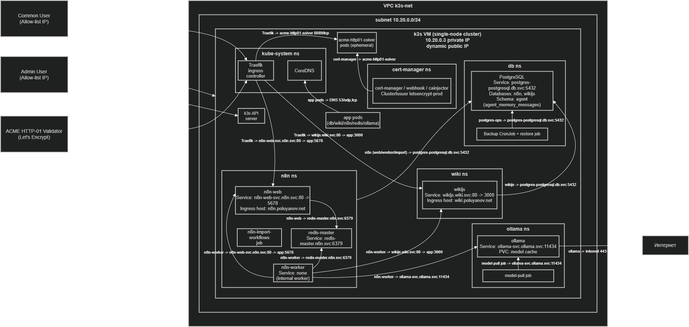

# Этап B (k3s): ранбук Kubernetes-деплоя

Пошаговый ранбук Kubernetes-слоя проекта.
Этот слой применяется через единый Helmfile и разворачивает platform + apps.

Индекс этапной документации: [README этапа B](../../docs/kubernetes_deploy/README.md)



## Быстрый старт

```bash
export KUBECONFIG="${KUBECONFIG:-$HOME/.kube/config-k3s}"

cd deploy/kubernetes

# Проверка рендера
helmfile -e prod build > /tmp/k3s-build.yaml

# Применение всех слоев
helmfile -e prod sync
```

## Связанная документация

- [Bootstrap k3s](./bootstrap/README.md)
- [Platform слой](./platform/README.md)
- [apps/postgres](./apps/postgres/README.md)
- [apps/redis](./apps/redis/README.md)
- [apps/wiki](./apps/wiki/README.md)
- [apps/ollama](./apps/ollama/README.md)
- [apps/n8n](./apps/n8n/README.md)

## Оглавление

- [Критерии готовности](#definition-of-done)
- [Что деплоится и в каком порядке](#step-1)
- [Предусловия](#step-2)
- [Проверка перед запуском](#step-3)
- [Порядок запуска](#step-4)
- [Проверка после деплоя](#step-5)
- [Обновление и удаление](#step-6)
- [Частые ошибки и быстрые фиксы](#step-7)

<a id="definition-of-done"></a>

## Критерии готовности

- `helmfile -e prod sync` завершился без ошибок.
- `cert-manager` pod-ы в `Running`.
- `ClusterIssuer` в `Ready=True`.
- Runtime приложения в `Running`:
  - `postgres` (`db`)
  - `redis` (`n8n`)
  - `wikijs` (`wiki`)
  - `ollama` (`ollama`)
  - `n8n-web` и `n8n-worker` (`n8n`)

<a id="step-1"></a>

## Что деплоится и в каком порядке

Порядок задается в [helmfile.yaml](./helmfile.yaml):

1. `platform/helmfile.yaml`
2. `apps/postgres/helmfile.yaml`
3. `apps/redis/helmfile.yaml`
4. `apps/wiki/helmfile.yaml`
5. `apps/ollama/helmfile.yaml`
6. `apps/n8n/helmfile.yaml`

<a id="step-2"></a>

## Предусловия

- Terraform-этап выполнен: `deploy/terraform/k3s_deploy`.
- Bootstrap-этап выполнен: `deploy/kubernetes/bootstrap`.
- Есть рабочий `KUBECONFIG` (`~/.kube/config-k3s`).
- Установлены:
  - `kubectl`
  - `helm`
  - `helmfile`
  - `sops`
  - `age`
- Установлен Helm plugin `secrets`.

<a id="step-3"></a>

## Проверка перед запуском

```bash
export KUBECONFIG="${KUBECONFIG:-$HOME/.kube/config-k3s}"

kubectl get nodes
helm version
helmfile --version
helm plugin list
```

<a id="step-4"></a>

## Порядок запуска

```bash
cd deploy/kubernetes
helmfile -e prod build > /tmp/k8s-stage-build.yaml
helmfile -e prod sync
```

Если нужно применить только один app-слой:

```bash
cd deploy/kubernetes/apps/n8n
helmfile -e prod sync
```

<a id="step-5"></a>

## Проверка после деплоя

```bash
kubectl get ns
kubectl -n cert-manager get pods
kubectl get clusterissuer

kubectl -n db get pods
kubectl -n n8n get deploy,pods,svc,ingress,job
kubectl -n wiki get deploy,pods,svc,ingress
kubectl -n ollama get deploy,pods,svc,pvc
```

Ключевые rollout-проверки:

```bash
kubectl -n n8n rollout status deploy/n8n-web
kubectl -n n8n rollout status deploy/n8n-worker
kubectl -n wiki rollout status deploy/wikijs
kubectl -n ollama rollout status deploy/ollama
```

<a id="step-6"></a>

## Обновление и удаление

Обновление:

```bash
cd deploy/kubernetes
helmfile -e prod sync
```

Удаление всего Kubernetes-слоя:

```bash
cd deploy/kubernetes
helmfile -e prod destroy
```

<a id="step-7"></a>

## Частые ошибки и быстрые фиксы

`Kubernetes cluster unreachable`:

- проверьте `KUBECONFIG`;
- проверьте доступность API `:6443`.

`failed to decrypt`:

- проверьте AGE ключ (`~/.config/sops/age/keys.txt`);
- проверьте доступ к `*.enc.yaml`.

`n8n workflows import failed`:

- проверьте логи:
  `kubectl -n n8n logs job/n8n-import-workflows --tail=200`.

`certificate not ready`:

- проверьте DNS;
- проверьте `kubectl describe clusterissuer letsencrypt-prod`;
- проверьте доступность HTTP-01 (`80/tcp`).
