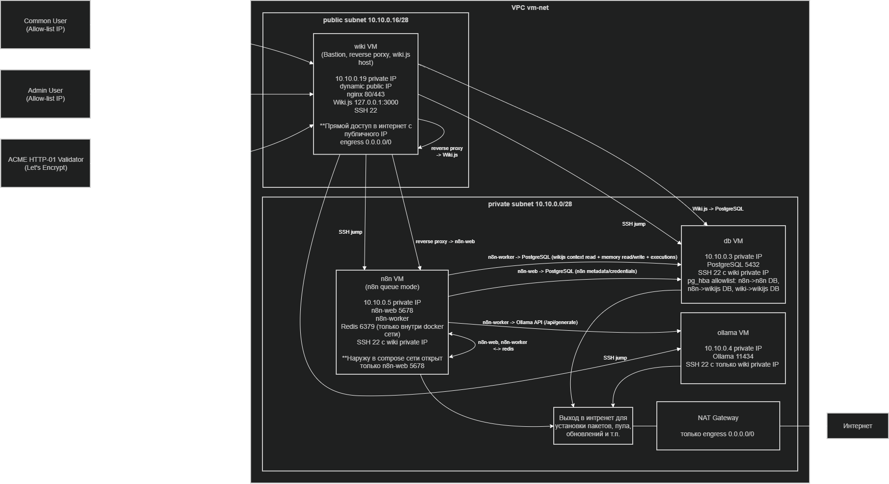

# Сеть Ansible-деплоя (Этап A, 4 VM)

## Цель сетевой модели

В Этапе A сеть спроектирована по принципу минимальной публичной поверхности и многоуровневой защиты:

- снаружи доступен только edge/bastion host (`wiki`),
- приватные VM (`db`, `n8n`, `ollama`) не имеют public IP,
- входящие потоки ограничены на нескольких слоях (Cloud SG, host firewall, reverse proxy),
- доступы описаны как явные сервисные потоки.

## Схема сети



## Источники правил (код)

- Terraform сеть и SG:
  - `deploy/terraform/ansible_deploy/network.tf`
  - `deploy/terraform/ansible_deploy/security.tf`
  - `deploy/terraform/ansible_deploy/variables.tf`
- Host firewall:
  - `deploy/ansible/roles/firewall/defaults/main.yml`
  - `deploy/ansible/roles/firewall/tasks/firewalld.yml`
- Хостовые firewall-правила:
  - `deploy/ansible/inventories/cloud/host_vars/wiki.yml`
  - `deploy/ansible/inventories/cloud/host_vars/n8n.yml`
  - `deploy/ansible/inventories/cloud/host_vars/db.yml`
  - `deploy/ansible/inventories/cloud/host_vars/ollama.yml`
- SSH jump:
  - `deploy/ansible/inventories/cloud/group_vars/private_hosts/main.yml`

## Сетевые зоны и trust boundary

- `public subnet` (по умолчанию `10.10.0.16/28`): только VM `wiki` с public IP.
- `private subnet` (по умолчанию `10.10.0.0/28`): `db`, `n8n`, `ollama` без public IP.
- Для `private subnet` задан маршрут `0.0.0.0/0 -> NAT Gateway`.

Практический эффект:

- прямой внешний доступ к приватным VM отсутствует на уровне адресации,
- администрирование приватных VM идет через bastion/ProxyJump,
- исходящий доступ приватного контура идет через NAT.

## Многоуровневые сетевые контроли

### Cloud Security Groups (внешний периметр)

`bastion_sg` (`wiki` VM):

- `22/tcp` из `firewall_admin_ssh_sources`
- `80/tcp` из `edge_http_cidrs` (по умолчанию `0.0.0.0/0`)
- `443/tcp` из `edge_allowed_client_cidrs`
- egress: `ANY -> 0.0.0.0/0`

`private_sg` (`db/n8n/ollama` VM):

- `22/tcp` только от `wiki` private IP
- `5432/tcp` только от `wiki` и `n8n`
- `5678/tcp` только от `wiki`
- `11434/tcp` только от `n8n`
- egress: `ANY -> 0.0.0.0/0`

### Host firewall (`firewalld`, роль `firewall`)

- зона с `target=DROP` (deny-by-default inbound),
- только source-restricted `rich_rule`,
- без broad-правил `allow port to all`,
- на Debian отключается `ufw` для исключения конфликтов.

### Edge layer (`nginx` allow-list)

Для `wiki` и `n8n` на edge-прокси дополнительно применяется allow-list:

- `allow` из `edge_allowed_client_cidrs`,
- `allow` loopback,
- `deny all`.

Итог: доступ к UI ограничен не только SG/firewall, но и на уровне reverse proxy.

## Модель доступов

### Административный доступ

- SSH на `wiki` только из `firewall_admin_ssh_sources`.
- SSH на приватные VM только через `wiki` (ProxyJump).

### Пользовательский доступ

- Доступ к `https://wiki.poluyanov.net` и `https://n8n.poluyanov.net` только из `edge_allowed_client_cidrs`.
- `80/tcp` используется для ACME HTTP-01 и `HTTP -> HTTPS` redirect.

### Внутренние сервисные потоки

| Источник | Назначение | Порт | Назначение потока |
|---|---|---|---|
| `wiki` | `n8n` | `5678/tcp` | reverse proxy -> `n8n-web` |
| `n8n` | `db` | `5432/tcp` | n8n runtime -> PostgreSQL |
| `wiki` | `db` | `5432/tcp` | Wiki.js -> PostgreSQL |
| `n8n` | `ollama` | `11434/tcp` | n8n runtime -> Ollama API |
| `wiki` | `db`, `n8n`, `ollama` | `22/tcp` | bastion SSH jump |

## Egress модель

В Этапе A детальная egress-фильтрация по сервисам не применяется.

- ingress жестко минимизирован,
- egress в SG оставлен `ANY`,
- приватные VM изолированы отсутствием public IP и выходят в интернет через NAT.

Это осознанный компромисс Этапа A: сильный inbound-периметр + сегментация подсетей.

## DNS и TLS в сетевой модели

- DNS A/AAAA для `wiki.poluyanov.net` и `n8n.poluyanov.net` указывают на public IP VM `wiki`.
- Сертификаты выпускаются через Let’s Encrypt ACME HTTP-01.
- Для HTTP-01 path `/.well-known/acme-challenge/*` должен оставаться доступен по HTTP без redirect.

## Что явно закрыто

- прямой внешний доступ к `db/n8n/ollama`,
- внешний доступ к `5432/5678/11434/6379`,
- прямой SSH к приватным VM не через bastion.

## Проверки: автоматические и операционные

### Автоматические (Ansible smoke)

`deploy/ansible/playbooks/smoke.yml` покрывает:

- внешний HTTPS health по доменам,
- HTTP-01 challenge path без redirect,
- `HTTP -> HTTPS` redirect,
- связность `n8n -> postgres` и `n8n -> ollama`,
- проверку сертификатов.

### Операционные (runbook)

```bash
cd deploy/ansible
ansible -i inventories/cloud/hosts.yml all -b -J -m shell -a "firewall-cmd --state"
ansible -i inventories/cloud/hosts.yml all -b -J -m shell -a "firewall-cmd --get-active-zones"
ansible -i inventories/cloud/hosts.yml all -b -J -m shell -a "firewall-cmd --list-rich-rules"
ansible-playbook -i inventories/cloud/hosts.yml playbooks/smoke.yml
```
